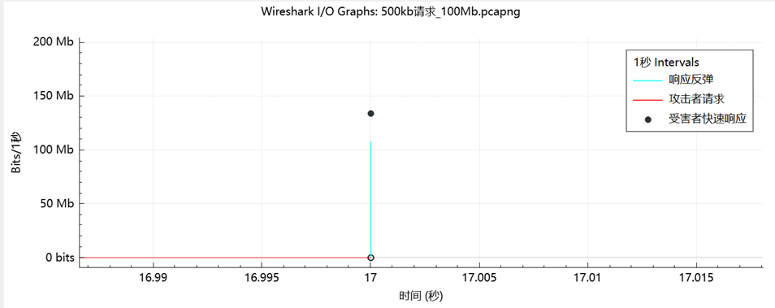

# 🛡️ DDoSKING - DDoS Attack Automation Simulation Tool

<div align="center">

### *DDoS Attack Simulation Environment for Network Security Research and Testing*
    
[](https://www.gnu.org/licenses/gpl-3.0)
[](https://docs.docker.com/engine/install/)
[](https://github.com/seed-labs/seed-emulator)
[](https://www.python.org/)
[](https://golang.org/)
    
</div>

## 📋 Project Overview

DDoSKING is a Docker-based state-of-the-art DDoS attack automation simulation tool designed for research and testing of various DDoS attack techniques. The project consists of two core components—DDoS attack plugins and network simulation components—built on the Seed-emulator to create simulated network environments with a visualization interface. Attack plugins are developed in Go and deployed in Docker containers.

This comprehensive simulation environment covers current mainstream DDoS attack methods and botnet attacks, including attack simulations targeting AI services like DeepSeek. The entire simulation environment can replicate complete internet and DDoS attack scenarios on a single host, making it an all-in-one DDoS testing platform available to security researchers and professionals.

You can extract the attack plugins separately for testing in real environments, but please ensure you do so in a secure and legal environment.

> **⚠️ Note**: Deploying DeepSeek 1.5B requires at least 8GB of memory.

## ✨ Why Choose DDoSKING?

DDoSKING stands out as the preferred DDoS simulation tool with the following key advantages:

- **🌟 All-in-One Solution**: Complete attack infrastructure simulation in a single environment
- **🔄 Comprehensive Attack Coverage**: Covers major DDoS attack types, including new pulse attacks like DNSBomb
- **🧠 Trending Attack Simulations**: Includes simulation scenarios of AI models like Deepseek under attack
- **🖼️ Visual Network Topology**: Interactive visualization for better understanding of attack paths
- **🔬 Research-Grade Testing**: Suitable for academic research and security testing
- **🛠️ Highly Customizable**: Easy to adjust parameters to adapt to custom attack scenarios
- **🌐 Fully Customizable Network Topology**: Build your own custom botnet infrastructure to match specific research scenarios

## 🌐 Network Customization Features

DDoSKING offers unparalleled flexibility in network design, enabling researchers to:

- **Create Custom Botnet Topologies**: You can create larger-scale botnets and custom network topologies by modifying ddosking.py
- **Bot Host Control**: Fine-tune parameters such as thread count, bandwidth, and other settings for bot hosts
- **Integrate Custom Attack Scripts**: Add your own attack methods through Go implementation
- **Mixed Attack Types**: Combine different attack vectors to create complex multi-vector attack scenarios, simulating trending attacks in real environments

The SeedEmu framework supporting DDoSKING enables you to simulate almost any network configuration, giving you complete freedom to build the exact botnet infrastructure needed for your research or testing.

## 📊 Performance and Features

DDoSKING has been rigorously tested to provide:

- Simulation of network environments with hundreds of nodes
- Simultaneous support for multiple attack vectors
- Real-time monitoring of attack effects
- Highly realistic network behavior modeling
- Containerized deployment for easy scaling and migration

## 🏆 Comparison with Other Solutions

| Feature | DDoSKING | Traditional DDoS Tools | Network Simulators |
|:-------:|:--------:|:----------------------:|:------------------:|
| Complete DDoS Infrastructure | ✅ | ❌ | ❌ |
| AI Service Attack Simulation | ✅ | ❌ | ❌ |
| Pulse Attack Support | ✅ | ❌ | ❌ |
| Visual Topology | ✅ | ❌ | ✅ |
| Single-Host Deployment | ✅ | ✅ | ❌ |
| Educational Value | ✅ | ⚠️ | ✅ |
| Research Applications | ✅ | ⚠️ | ✅ |

## 💻 System Requirements

To run the complete simulation environment, memory over 24GB is recommended.

## 🧩 System Components

We have built a sample environment for demonstration purposes. This environment simulates a complete DDoS attack infrastructure composed of the following independently built components:

| Component | Quantity | Description |
|:--------------------:|:--------:|:-------------------------------------:|
| 🎮 C2 Server | 1 | Responsible for sending attack commands to bot machines |
| 🔄 Reflection Amplification Servers | 5 | Used for Layer 4 DDoS reflection amplification attacks |
| 🤖 Bot Machines | 2 | Execute various attacks |
| 🔍 Unbound DNS Resolver | 1 | Configured specifically for pulse attacks |
| 🌐 DNS Authoritative Server | 1 | Used to accumulate and amplify pulse attack requests |
| 🧠 DeepSeek 1.5B Server | 1 | Simulates HTTP attacks targeting AI services |
| 🎯 Victim Server | 1 | Simulates the target server under attack |

> **ℹ️ Note**: This simulation environment focuses on DDoS simulation and does not simulate botnet propagation or communication mechanisms (such as brute-forcing weak passwords, DGA searching for C2, etc.). These features may be added in future versions.

Other nodes are automatically generated by SeedEmu. For more details, please refer to the [SeedEmu official documentation](https://github.com/seed-labs/seed-emulator).

## 💥 Attack Types

DDoSKING covers various types of DDoS attacks, mainly categorized as follows:

### 1. 🌊 Link Flood Attacks (Layer 4)

Attacks that fill network bandwidth with large volumes of traffic, including:

- **Direct Attacks**: UDP Floods
- **Reflection Amplification Attacks**: Amplification attacks using DNS, NTP, CLDAP, SSDP, and other protocols

### 2. 🔋 Resource Exhaustion Attacks (Layer 7)

Attacks that exhaust server computing resources, including:

- **HTTP Floods**: GET, POST-related methods, Slowloris, and other slow-rate attacks
- **Complex Prompt Attacks Against DeepSeek**: Consuming AI service computational resources
- **SYN Floods**: Depleting the target's half-open connection queue

### 3. ⚡ Pulse Attacks

Pulse attacks aim to send high-bandwidth packets in a short time, causing target queues to fill up, triggering timeouts and TCP congestion control, which degrades target TCP services. These attacks have relatively low total data volume but are highly destructive due to their concentrated burst nature:

- **DNSBomb**: Based on research work from IEEE S&P 24, reference link: [DNSBomb: A New Practical-and-Powerful Pulsing DoS Attack Exploiting DNS Queries-and-Responses | IEEE Conference Publication | IEEE Xplore](https://ieeexplore.ieee.org/abstract/document/10646654)

- **DNSBoomerang**: An improved attack based on DNSBomb, enhancing attack effectiveness by significantly increasing accumulated data volume. The number of accumulated packets increases with the number of DNS reflectors. In a public experiment, an attacker accumulated requests at 530kbps from 500 different reflector servers. After 17 seconds (accumulating 13,700 requests), the reflection bandwidth reached 108Mbps, lasting about 1 second, achieving a 204x amplification effect.
  <div style=text-align:left>
      
      
  </div>

## 🚀 Environment Setup

It is recommended to deploy the environment on Linux. You can use tc to limit Docker network speeds for more precise traffic simulation.

### 📦 Installation Steps

#### 1. Docker Installation and Configuration

- Install Docker: [Refer to the official documentation](https://docs.docker.com/engine/install/)
- **Note**: Users in mainland China may need to configure Docker mirror sources, as the default DockerHub may have access restrictions.

#### 2. Install Project Dependencies

```bash
# Run in the project root directory
pip3 install -r requirements.txt
```

### 🏃 Start the Simulation Environment

```bash
# Run in the root directory
python3 ddosking.py

# Build and start Docker containers
cd output
docker-compose build && docker-compose up -d  # First-time build takes about half an hour

# Shut down the simulation environment
docker-compose down
```

To ensure normal operation of spoofed packet sending, you need to clear NAT rules built by Docker:

```bash
iptables -t nat -F
```

> **💡 Tip**: NAT rules can be restored by restarting Docker

Access the following URL in your browser to view the network topology map:

```
http://127.0.0.1:8080/map.html
```

## ⚙️ Attack Configuration

### C2 Server Setup

```bash
cd /root/c2
go run main.go  # Start the C2 server and begin listening
```

### Bot Node Setup

```bash
# Automatic configuration, no manual operation required
cd /root/bot
go run .  # Start the service and connect to the C2 server
```

You can configure bot hosts in `bot/attacker/attack/config.go`, including packet rate limiting, thread count, and other parameters.

### Reflector Node Setup

```bash
cd /root/reflector
go run main.go  # Start the service
# Enter 1 to begin listening
```

### Unbound Server Setup

```bash
# Used for pulse attacks
service unbound start  # Start the service
```

### DeepSeek Node Setup

```bash
# With tmux pre-installed, enter tmux first and then input command to start
tmux
OLLAMA_HOST=0.0.0.0 ollama serve

# After starting, press ctrl b+d to exit, then enter the following command in another terminal to start the terminal session
ollama run deepseek-r1:1.5b
```

### Attack Parameter Adjustment

You can modify packet sending rates and other attack parameters in `bot/attacker/attack/config.go`.

## 📝 Notes

1. **Reflection Amplification Attack Traffic Limitations**: After receiving packets, reflector amplifiers call functions to construct packets and then forward them. Due to CPU performance limitations, reflection amplification attack traffic is much smaller than direct UDP attacks (after the attack stops, reflectors will continue to process backlogged packets, extending the attack duration). You can adjust attack rates accordingly.
2. **Network Issue Handling**: If you encounter network issues during use, try restarting Docker and clearing iptables rules.
3. **Safe Usage Principles**: Please use this tool in a secure, controlled environment, solely for learning and research purposes.

## 🔮 Future Development

We are continuously improving DDoSKING, with plans to add:

- More AI service attack simulation scenarios
- Botnet propagation mechanism simulation
- Extended attack vector library
- Enhanced visualization and analysis capabilities
- Integration with mainstream security tools
- Performance optimization and resource usage reduction

## 📜 License

This project is released under the [GNU General Public License v3.0 (GNU GPL v3)](https://www.gnu.org/licenses/gpl-3.0.html). For detailed terms, please refer to the LICENSE file in the project root directory.

## ⚠️ Disclaimer

This project is intended solely for security research and educational purposes. Do not use it for any illegal activities. Users must bear full legal responsibility for any consequences arising from improper use.
