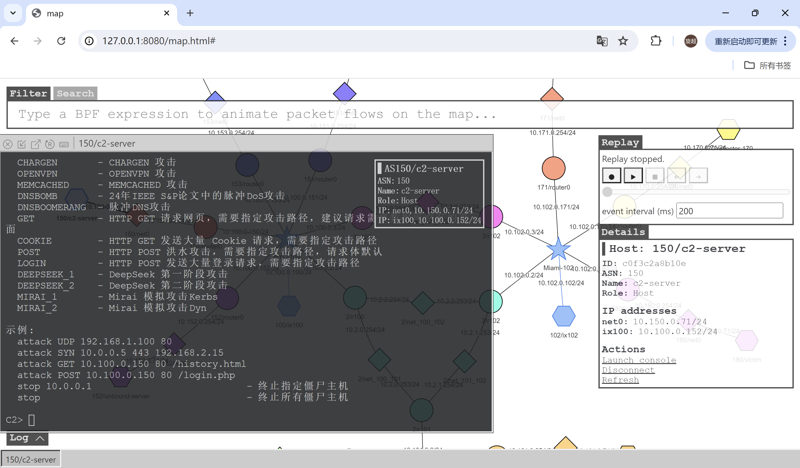
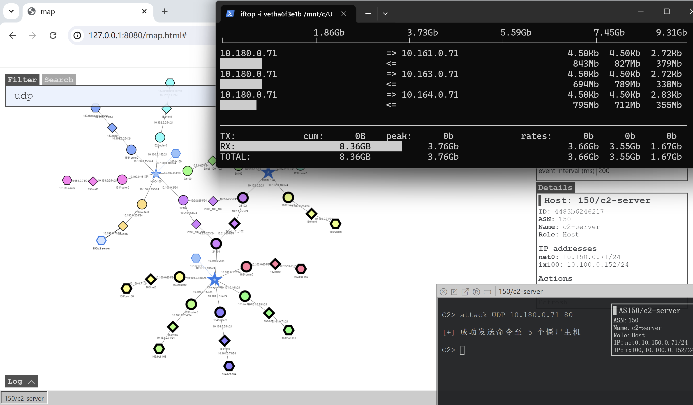
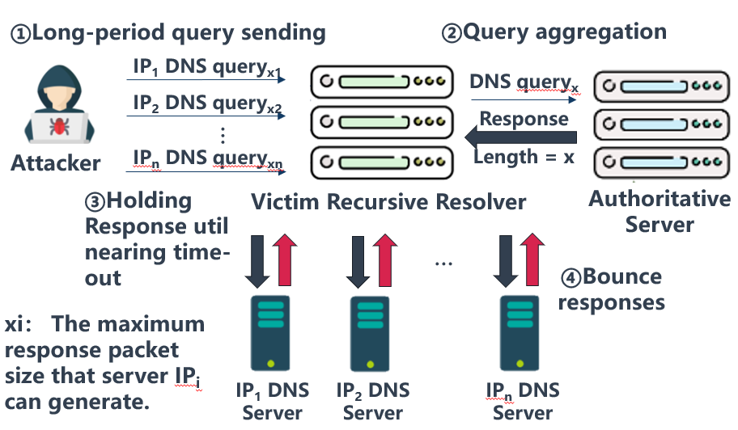
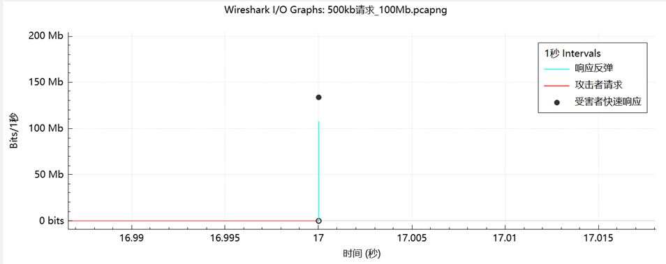

# 🛡️ DDoSKING - DDoS Attack Automation Simulation Tool

<div align="center">

### *The Ultimate DDoS Attack Simulation Environment for Network Security Research and Testing*
    
[](https://www.gnu.org/licenses/gpl-3.0)
[](https://docs.docker.com/engine/install/)
[](https://github.com/seed-labs/seed-emulator)
[](https://www.python.org/)
[](https://golang.org/)
    
</div>

## 📋 Project Overview
DDOSKing is a state-of-the-art DDoS attack simulation environment based on Docker, specifically designed for researching and testing various DDoS attack techniques. This project uses Seed-emulator to build a simulated network environment and provides a visual interface. The attack scripts are developed in Go and deployed in Docker containers.

This comprehensive simulation environment mimics current mainstream DDoS attack methods and botnet attacks, and includes simulations of attacks against AI services like DeepSeek. The entire simulation environment can simulate a complete internet and DDoS attack scenario on a single host, making it the most advanced all-in-one DDoS testing platform available for security researchers and professionals.

> **⚠️ Note**: At least 8GB of memory is required to deploy DeepSeek 1.5B.

## ✨ Why DDoSKING?

DDoSKING stands out as the premier DDoS simulation tool due to these key advantages:

- **🌟 All-in-One Solution**: Complete attack infrastructure simulation in a single environment
- **🔄 Comprehensive Attack Coverage**: Simulates all major DDoS attack types in one platform
- **🧠 AI Service Attack Simulation**: Unique capability to test attacks against AI models
- **⚡ Cutting-Edge Attack Methods**: Includes novel pulse attacks like DNSBomb and DNSBoomerang
- **🖼️ Visual Network Topology**: Interactive visualization for better understanding of attack paths
- **🔬 Research-Grade Testing**: Perfect for academic research and security testing
- **🛠️ Highly Customizable**: Easy to adjust parameters for custom attack scenarios
- **🌐 Fully Customizable Network Topology**: Build your own tailored botnet infrastructure to match specific research scenarios

## 🎯 What Can You Do With DDoSKING?

- **Security Research**: Understand modern DDoS attack mechanisms in a controlled environment
- **Custom Botnet Development**: Design and build your own botnet architecture to test specific attack scenarios
- **Defensive Testing**: Develop and test DDoS mitigation strategies without affecting production systems
- **Education**: Perfect teaching tool for cybersecurity courses and training programs
- **Security Audits**: Evaluate network infrastructure resilience against various attack types
- **AI Service Hardening**: Test and improve AI service robustness against targeted attacks
- **Performance Benchmarking**: Measure how different systems handle various types of traffic loads
- **Security Product Testing**: Validate the effectiveness of DDoS protection products




## 💻 System Requirements

To run the simulation environment fully, it is recommended to have more than 24GB of memory.

## 🧩 System Components

This simulation environment simulates the complete DDoS attack infrastructure, consisting of the following independently built components:

| Component            | Quantity | Description                           |
|:--------------------:|:--------:|:-------------------------------------:|
| 🎮 C2 Server            | 1       | Responsible for sending attack commands to bot machines |
| 🔄 Reflection Amplifier Server | 2     | Used for Layer 4 DDoS reflection amplification attacks |
| 🤖 Bot Machines         | 5       | Executes various attacks              |
| 🔍 Unbound DNS Resolver | 1       | Specially configured for pulse attacks |
| 🌐 DNS Authority Server | 1       | Used for accumulating and amplifying requests for pulse attacks |
| 🧠 DeepSeek 1.5B Server | 1       | Simulates HTTP attacks on AI services |

> **ℹ️ Note**: This simulation environment focuses on DDoS simulations and does not simulate botnet propagation or communication mechanisms (such as brute-forcing weak passwords, DGA searching for C2, etc.). These may be added in a future version.

Other nodes are automatically generated by SeedEmu. For more details, refer to the [SeedEmu Official Documentation](https://github.com/seed-labs/seed-emulator).

## 💥 Attack Types

DDOSKing covers various types of DDoS attacks, mainly divided into the following categories:

### 1. 🌊 Link Flooding Attacks (Layer 4)

Attacks that fill up network bandwidth with a large volume of traffic, including:

- **Direct Attacks**: UDP flood
- **Reflection Amplification Attacks**: DNS, NTP, CLDAP, SSDP, etc.

### 2. 🔋 Resource Exhaustion Attacks (Layer 7)

Attacks that exhaust server computational resources, including:

- **HTTP Flood**: To keep the environment lightweight, the web service only provides a single page
- **Constructing complex prompts against DeepSeek**: Consumes AI service resources
- **SYN Flood**: Exhausts the target's half-open connection queue

### 3. ⚡ Pulse Attacks

Pulse attacks aim to send high-bandwidth packets in a short period (with relatively low data volume, hence short duration), causing the target's queue to fill up, resulting in timeouts and triggering TCP congestion control, which causes the target TCP service to degrade.

- **DNSBomb**: A work from IEEE S&P 24, reference link: [DNSBomb: A New Practical-and-Powerful Pulsing DoS Attack Exploiting DNS Queries-and-Responses | IEEE Conference Publication | IEEE Xplore](https://ieeexplore.ieee.org/abstract/document/10646654)

- **DNSBoomerang**: Based on DNSBomb, DNSBoomerang improves it by significantly increasing the accumulated data (the accumulated packet number increases as the number of DNS reflectors increases). In public experiments, the attacker accumulates requests at a rate of 530kbps, with the source IP from 500 different reflection servers (which respond with response packets). After 17 seconds (accumulating 13,700 requests), the reflected bandwidth reaches 108Mbps, and the duration is about 1 second, amplifying by 204 times.
  <div style=text-align:left>
      
      
  </div>

## 🚀 Environment Setup

It is recommended to set up the environment on Linux. Windows users can use WSL.

### 📦 Installation Steps

#### 1. Docker Installation and Configuration

- Install Docker: [Reference official documentation](https://docs.docker.com/engine/install/)
- **Note**: Users in mainland China may need to configure Docker image sources since the default DockerHub may not be accessible.

#### 2. Install Project Dependencies

```bash
# Run in the project root directory
pip3 install -r requirements.txt

# Set Python environment variables
source development.dev
```

#### 3. Prepare Docker Images

```bash
# Enter the ddosking directory and create the image directory
cd ddosking
mkdir image
cd image

# Place the downloaded image files into the image directory and load the Docker images
docker load -i ddosking.tar
docker load -i ollama.tar
docker load -i unbound.tar
```

Image download address: [Link](https://rec.ustc.edu.cn/share/e961def0-f679-11ef-8767-d33b1f047ce8)  
(Password: 1958)

### 🏃 Start Simulation Environment

```bash
# Run in the ddosking directory
python3 ddosking.py

# Build and start Docker containers
cd output
docker-compose build  # The first build takes about half an hour
docker-compose up

# Shut down the simulation environment
docker-compose down
```

To ensure the normal operation of the forged packet sending, you need to clear the NAT rules built by Docker:

```bash
iptables -t nat -F
```

> **💡 Tip**: It is recommended to save the NAT rules before clearing them, so they can be restored for debugging.

Visit the following URL in a browser to view the network topology map:

```
http://127.0.0.1:8080/map.html
```

## ⚙️ Attack Configuration

The bot machines in the botnet need to be configured with the IP addresses of the C2 server, reflectors, and Unbound DNS resolver.

### C2 Server Setup

```bash
cd /root/c2
go run main.go  # Start the C2 server to begin listening
```

### Bot Node Setup

```bash
# Automatically configured, no manual operation required
cd /root/bot
echo 10.150.0.71 > serverfile/c2.txt  # Add C2 server IP address
echo -e "10.171.0.71\n10.170.0.71" > serverfile/reflector.txt  # Add reflector IP addresses
echo 10.152.0.71 > serverfile/resolver.txt  # Add Unbound server IP address
go run main.go  # Start the service and connect to the C2 server
```

### Reflector Node Setup

```bash
cd /root/reflector
go run main.go  # Start the service
# Enter 1 to start listening
```

### Unbound Server Setup

```bash
# For pulse attacks
/etc/init.d/unbound start  # Start the service
```

### DeepSeek Node Setup

```bash
cd /usr/local/bin/

# Pre-installed tmux, can enter tmux first and then input commands to start
tmux
OLLAMA_HOST=0.0.0.0 ollama serve

# After starting, input the following command in another terminal to start the terminal session
ollama run deepseek-r1:1.5b
```

### Attack Parameter Adjustment

You can modify the packet sending rate and other attack parameters in the `bot/attacker/attack` directory.

## 📝 Notes

1. **Reflection Amplification Attack Traffic Limitation**: After the reflection amplifier receives the packet, it will call a function to construct the packet and then forward it. Due to CPU performance limitations, the traffic for reflection amplification attacks is much smaller than for UDP direct attacks (after the attack stops, the reflectors will still process unprocessed packets, extending the attack duration). You can adjust the attack rate accordingly.
2. **Network Issues**: If network problems occur during use, try clearing the iptables rules.
3. **Safe Usage**: Please use this tool in a secure environment and only for learning and research purposes.

## 🔧 Tech Stack

- **🐳 Docker**: Containerization technology
- **🌐 SeedEmu**: Network simulation framework
- **🚀 Go**: Attack script development language
- **🐍 Python**: Environment setup scripts
- **🧠 Ollama**: Deploy DeepSeek 1.5B model

## 🌐 Network Customization Features

DDoSKING offers unparalleled flexibility in network design, allowing researchers to:

- **Create Custom Botnet Topologies**: Design network structures that match real-world scenarios or theoretical models
- **Scale Your Botnet**: Add as many bot nodes as your hardware can support to test large-scale attacks
- **Configure Node Relationships**: Define C2 server hierarchies and bot communication patterns
- **Simulate Geographic Distribution**: Create network segments that mimic geographically distributed botnets
- **Model Different Network Conditions**: Simulate various bandwidth, latency, and packet loss scenarios
- **Integrate Custom Attack Scripts**: Add your own attack methods by implementing them in Go
- **Mix Attack Types**: Combine different attack vectors to create sophisticated multi-vector attack scenarios

The SeedEmu framework that powers DDoSKING enables you to model virtually any network configuration, giving you complete freedom to construct the exact botnet infrastructure needed for your research or testing purposes.

## 📊 Performance and Capabilities

DDoSKING has been rigorously tested and offers:

- Simulation of network environments with hundreds of nodes
- Support for multiple attack vectors simultaneously
- Real-time monitoring of attack effects
- Highly realistic network behavior modelling
- Containerized approach for easy deployment and scaling

## 🏆 Comparison with Other Solutions

| Feature | DDoSKING | Traditional DDoS Tools | Network Simulators |
|:-------:|:--------:|:----------------------:|:------------------:|
| Complete DDoS Infrastructure | ✅ | ❌ | ❌ |
| AI Service Attack Simulation | ✅ | ❌ | ❌ |
| Pulse Attack Support | ✅ | ❌ | ❌ |
| Visual Topology | ✅ | ❌ | ✅ |
| Single-Host Deployment | ✅ | ✅ | ❌ |
| Educational Value | ✅ | ⚠️ | ✅ |
| Research Applications | ✅ | ⚠️ | ✅ |

## 📜 License
This project is released under the [GNU General Public License v3.0 (GNU GPL v3)](https://www.gnu.org/licenses/gpl-3.0.html). For detailed terms, please refer to the `LICENSE` file in the project root directory.

## 🔮 Future Development

We're continuously improving DDoSKING with plans to add:

- More AI service attack simulations
- Botnet propagation mechanisms
- Additional attack vectors
- Enhanced visualization and analytics
- Integration with common security tools
- Performance optimizations

## ⚠️ Disclaimer

This project is for security research and educational purposes only. Please do not use it for any illegal activities. Users must bear full legal responsibility for any consequences arising from improper use.
