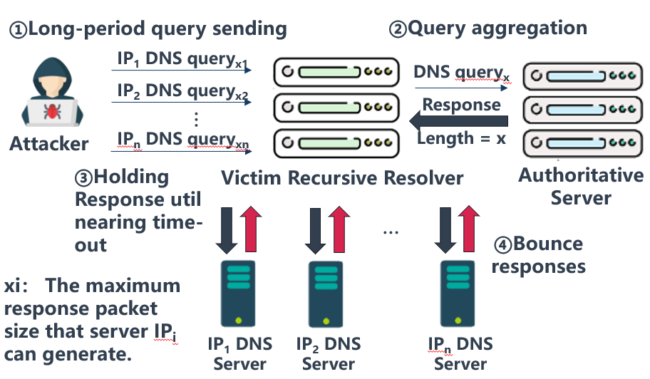
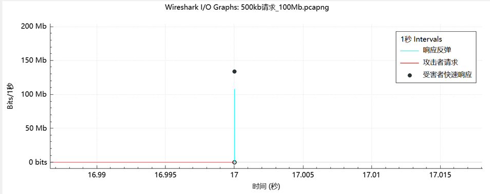

# 🛡️ DDoSKING - DDoS攻击自动化模拟工具

<div align="center">

### *网络安全研究与测试的DDoS攻击模拟环境*
    
[](https://www.gnu.org/licenses/gpl-3.0)
[](https://docs.docker.com/engine/install/)
[](https://github.com/seed-labs/seed-emulator)
[](https://www.python.org/)
[](https://golang.org/)
    
</div>

## 📋 项目概述

DDoSKING是一个基于Docker的最先进DDoS攻击模拟环境，专为研究和测试各种DDoS攻击技术而设计。该项目使用Seed-emulator构建模拟网络环境并提供可视化界面。攻击脚本使用Go语言开发并部署在Docker容器中。

这个全面的模拟环境模拟了当前主流的DDoS攻击方法和僵尸网络攻击，并包括针对DeepSeek等AI服务的攻击模拟。整个模拟环境可以在单个主机上模拟完整的互联网和DDoS攻击场景，使其成为安全研究人员和专业人士可用的最先进的一体化DDoS测试平台。

> **⚠️ 注意**：部署DeepSeek 1.5B至少需要8GB内存。

## ✨ 为什么选择DDoSKING？

DDoSKING作为首选的DDoS模拟工具脱颖而出，具有以下关键优势：

- **🌟 一体化解决方案**：在单一环境中完成攻击基础设施模拟
- **🔄 全面的攻击覆盖**：覆盖主要DDoS攻击类型，同时包括DNSBomb等新型脉冲攻击
- **🧠 热点事件攻击模拟**：包含Deepseek等AI模型受攻击的模拟仿真
- **🖼️ 可视化网络拓扑**：交互式可视化，更好地理解攻击路径
- **🔬 研究级测试**：适用于学术研究和安全测试
- **🛠️ 高度可定制**：易于调整参数以适应自定义攻击场景
- **🌐 完全可定制的网络拓扑**：构建您自己的定制僵尸网络基础设施，以匹配特定研究场景

## 🎯 您可以用DDoSKING做什么？

- **安全研究**：在可控环境中了解现代DDoS攻击机制
- **自定义僵尸网络开发**：设计和构建您自己的僵尸网络架构，测试特定攻击场景
- **防御测试**：开发和测试DDoS缓解策略，而不影响生产系统
- **教育**：网络安全课程和培训计划的完美教学工具
- **安全审计**：评估网络基础设施对各种攻击类型的抵抗力
- **AI服务加固**：测试和改进AI服务对针对性攻击的鲁棒性
- **性能基准测试**：测量不同系统如何处理各种类型的流量负载
- **安全产品测试**：验证DDoS防护产品的有效性

## 🌐 网络自定义功能

DDoSKING在网络设计方面提供无与伦比的灵活性，使研究人员能够：

- **创建自定义僵尸网络拓扑**：设计匹配真实世界场景或理论模型的网络结构
- **扩展您的僵尸网络**：添加硬件能支持的尽可能多的僵尸节点，测试大规模攻击
- **配置节点关系**：定义C2服务器层次结构和僵尸通信模式
- **模拟地理分布**：创建模拟地理分布式僵尸网络的网络段
- **模拟不同网络条件**：模拟各种带宽、延迟和丢包场景
- **集成自定义攻击脚本**：通过Go语言实现添加您自己的攻击方法
- **混合攻击类型**：组合不同的攻击向量，创建复杂的多向量攻击场景

支持DDoSKING的SeedEmu框架使您能够模拟几乎任何网络配置，让您完全自由地构建研究或测试所需的精确僵尸网络基础设施。

## 📊 性能和功能

DDoSKING经过严格测试，提供：

- 模拟包含数百个节点的网络环境
- 同时支持多种攻击向量
- 实时监控攻击效果
- 高度逼真的网络行为建模
- 容器化方法，便于部署和扩展

## 🏆 与其他解决方案的比较

| 功能 | DDoSKING | 传统DDoS工具 | 网络模拟器 |
|:-------:|:--------:|:----------------------:|:------------------:|
| 完整DDoS基础设施 | ✅ | ❌ | ❌ |
| AI服务攻击模拟 | ✅ | ❌ | ❌ |
| 脉冲攻击支持 | ✅ | ❌ | ❌ |
| 可视化拓扑 | ✅ | ❌ | ✅ |
| 单主机部署 | ✅ | ✅ | ❌ |
| 教育价值 | ✅ | ⚠️ | ✅ |
| 研究应用 | ✅ | ⚠️ | ✅ |

## 💻 系统要求

要完整运行模拟环境，建议内存超过24GB。

## 🧩 系统组件

此模拟环境模拟完整的DDoS攻击基础设施，由以下独立构建的组件组成：

| 组件 | 数量 | 描述 |
|:--------------------:|:--------:|:-------------------------------------:|
| 🎮 C2服务器 | 1 | 负责向僵尸机器发送攻击命令 |
| 🔄 反射放大服务器 | 5 | 用于第4层DDoS反射放大攻击 |
| 🤖 僵尸机器 | 2 | 执行各种攻击 |
| 🔍 Unbound DNS解析器 | 1 | 专为脉冲攻击配置 |
| 🌐 DNS权威服务器 | 1 | 用于积累和放大脉冲攻击请求 |
| 🧠 DeepSeek 1.5B服务器 | 1 | 模拟针对AI服务的HTTP攻击 |

> **ℹ️ 注意**：此模拟环境专注于DDoS模拟，不模拟僵尸网络传播或通信机制（如暴力破解弱密码、DGA搜索C2等）。这些功能可能在未来版本中添加。

其他节点由SeedEmu自动生成。更多详情，请参考[SeedEmu官方文档](https://github.com/seed-labs/seed-emulator)。

## 💥 攻击类型

DDoSKING涵盖各种类型的DDoS攻击，主要分为以下几类：

### 1. 🌊 链路洪水攻击（第4层）

用大量流量填满网络带宽的攻击，包括：

- **直接攻击**：UDP洪水
- **反射放大攻击**：DNS、NTP、CLDAP、SSDP等

### 2. 🔋 资源耗尽攻击（第7层）

耗尽服务器计算资源的攻击，包括：

- **HTTP洪水**：为保持环境轻量，Web服务仅提供单页面
- **构建针对DeepSeek的复杂提示**：消耗AI服务资源
- **SYN洪水**：耗尽目标的半开连接队列

### 3. ⚡ 脉冲攻击

脉冲攻击旨在短时间内发送高带宽数据包（数据量相对较低，因此持续时间短），导致目标队列填满，产生超时并触发TCP拥塞控制，使目标TCP服务降级。

- **DNSBomb**：IEEE S&P 24的一项工作，参考链接：[DNSBomb: A New Practical-and-Powerful Pulsing DoS Attack Exploiting DNS Queries-and-Responses | IEEE Conference Publication | IEEE Xplore](https://ieeexplore.ieee.org/abstract/document/10646654)

- **DNSBoomerang**：基于DNSBomb，DNSBoomerang通过显著增加累积数据来改进它（累积的数据包数量随DNS反射器数量增加而增加）。在公共实验中，攻击者以530kbps的速率累积请求，源IP来自500个不同的反射服务器（这些服务器响应数据包）。17秒后（累积13,700个请求），反射带宽达到108Mbps，持续时间约1秒，放大204倍。
  <div style=text-align:left>
      
      
  </div>

## 🚀 环境设置

建议在Linux上设置环境。Windows用户可以使用WSL。

### 📦 安装步骤

#### 1. Docker安装和配置

- 安装Docker：[参考官方文档](https://docs.docker.com/engine/install/)
- **注意**：中国大陆用户可能需要配置Docker镜像源，因为默认的DockerHub可能无法访问。

#### 2. 安装项目依赖

```bash
# 在项目根目录运行
pip3 install -r requirements.txt

# 设置Python环境变量
source development.dev
```

### 🏃 启动模拟环境

```bash
# 根目录运行
python3 ddosking.py

# 构建并启动Docker容器
cd output
docker-compose build  # 首次构建大约需要半小时
docker-compose up

# 关闭模拟环境
docker-compose down
```

为确保伪造数据包发送的正常运行，您需要清除Docker构建的NAT规则：

```bash
iptables -t nat -F
```

> **💡 提示**：建议在清除前保存NAT规则，以便调试时可以恢复。

在浏览器中访问以下URL查看网络拓扑图：

```
http://127.0.0.1:8080/map.html
```

## ⚙️ 攻击配置

僵尸网络中的僵尸机器需要配置C2服务器、反射器和Unbound DNS解析器的IP地址。

### C2服务器设置

```bash
cd /root/c2
go run main.go  # 启动C2服务器开始监听
```

### 僵尸节点设置

```bash
# 自动配置，无需手动操作
cd /root/bot
echo 10.150.0.71 > serverfile/c2.txt  # 添加C2服务器IP地址
echo -e "10.171.0.71\n10.170.0.71" > serverfile/reflector.txt  # 添加反射器IP地址
echo 10.152.0.71 > serverfile/resolver.txt  # 添加Unbound服务器IP地址
go run main.go  # 启动服务并连接到C2服务器
```

### 反射器节点设置

```bash
cd /root/reflector
go run main.go  # 启动服务
# 输入1开始监听
```

### Unbound服务器设置

```bash
# 用于脉冲攻击
service unbound start  # 启动服务
```

### DeepSeek节点设置

```bash
# 预安装tmux，可以先进入tmux然后输入命令启动
tmux
OLLAMA_HOST=0.0.0.0 ollama serve

# 启动后，ctrl b+d 退出，在另一个终端输入以下命令启动终端会话
ollama run deepseek-r1:1.5b
```

### 攻击参数调整

您可以在`bot/attacker/attack/config.go`中修改数据包发送速率和其他攻击参数。

## 📝 注意事项

1. **反射放大攻击流量限制**：反射放大器接收数据包后，会调用函数构造数据包然后转发。由于CPU性能限制，反射放大攻击的流量比UDP直接攻击小很多（攻击停止后，反射器仍会处理未处理的数据包，延长攻击持续时间）。您可以相应调整攻击速率。
2. **网络问题**：使用过程中如果出现网络问题，请尝试清除iptables规则。
3. **安全使用**：请在安全环境中使用此工具，仅用于学习和研究目的。

## 🔧 技术栈

- **🐳 Docker**：容器化技术
- **🌐 SeedEmu**：网络模拟框架
- **🚀 Go**：攻击脚本开发语言
- **🐍 Python**：环境设置脚本
- **🧠 Ollama**：部署DeepSeek 1.5B模型

## 🔮 未来发展

我们正在不断改进DDoSKING，计划添加：

- 更多AI服务攻击模拟
- 僵尸网络传播机制
- 额外的攻击向量
- 增强的可视化和分析
- 与常见安全工具的集成
- 性能优化

## 📜 许可证
本项目根据[GNU通用公共许可证v3.0（GNU GPL v3）](https://www.gnu.org/licenses/gpl-3.0.html)发布。详细条款，请参阅项目根目录中的`LICENSE`文件。

## ⚠️ 免责声明

本项目仅用于安全研究和教育目的。请勿将其用于任何非法活动。用户必须对不当使用产生的任何后果承担全部法律责任。
